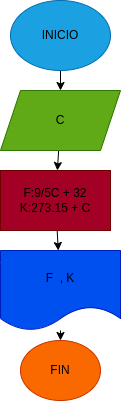

# Ejercicio N.2 Temperatura

## Programa para realizar conversiones de temperatura 

# ANALISIS

Variables de entrada (imput)

C:Grados centigrado

Variables de proceso y salida (processing, storage, output)

F:Grados farenheit

K:Grados kelvin

# DISEÑO

# CONSTRUCCION
